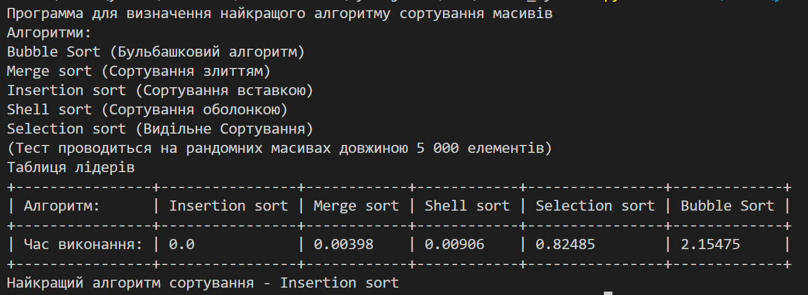
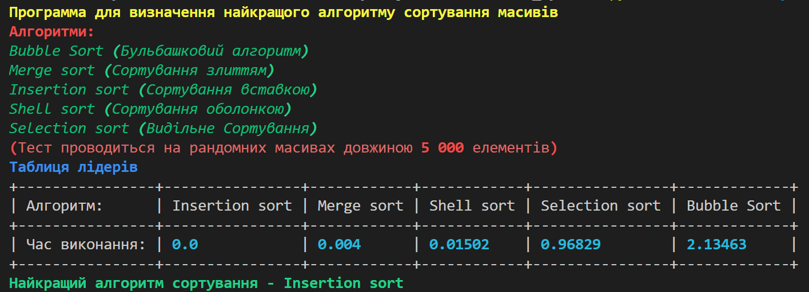

# Docker_Python
---
Проект для ознайомлення із технологією Docker

Як приклад у мене створено проста консольна який порівнює всі відомі алгоритми сортування на певній кількості елементів, виводить всю інформацію, виводить таблицю. Для ускладнення Docker программи добавлений модуль "rich", цей модуль дозволяє розфарбовувати текст в консолі.

Щоб створити Docker контейнер потрібно ввійти в папку "script", та запустити команду:

```docker
docker build -t sorted_algoritm .
```

Після чого ви в программі Docker побачите що у вас присуьній контейнер "sorted_container".
Щоб запустити контейнер необхідно ввести команду
```docker
docker run --name sorted_container sorted_algoritm
```
При такому запуску контейнера ми побачимо наступний результат:



Але тут текст монотонний і не працює модуль rich, для того щоб це виправити контейнер потрібно запустити наступним чином:

```docker
docker run -it -e DISPLAY=$DISPLAY --name sorted_container sorted_algoritm
```

При такому запуску результат буде наступним:

